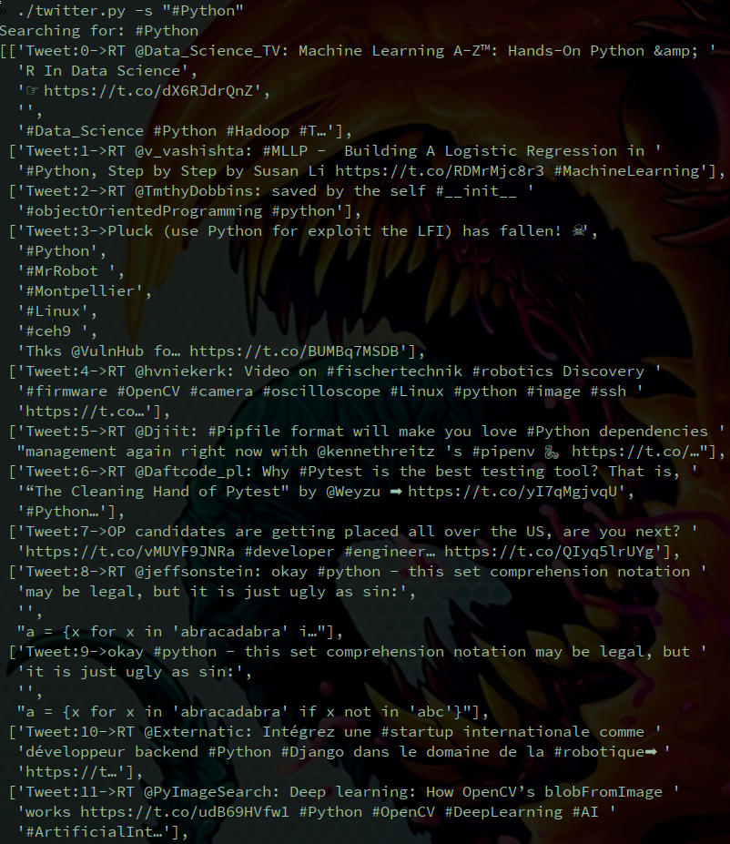
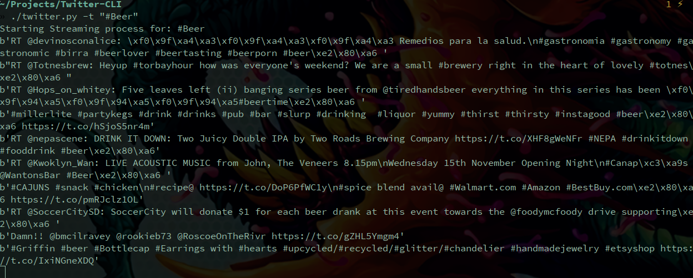

# Twitter CLI Client #
### Tweet, Search or Stream from your command line ###

This script basically encapsulates what the wonderful library of [Twython](https://github.com/ryanmcgrath/twython) can do, so big props to the creator.

## Screenshots ##

1. Tweeting

2. Searching

3. Streaming

---

#Installation:

1. Clone the repository to your local machine
2. Create an application so you can obtain your api keys and authentication keys on [Apps Twitter](https://apps.twitter.com/)
3. Modify the ``twitterConfig.yaml`` file with your appropriate keys. File found inside your cloned repo.

        --- # Twitter API Credentials
        Twitter_API:
            CONSUMER_KEY: 'YOUR KEY GOES HERE'
            CONSUMER_SECRET: 'YOUR KEY GOES HERE'
            AUTH_TOKEN: 'YOUR KEY GOES HERE'
            AUTH_SECRET: 'YOUR KEY GOES HERE'

4. Add execution permission to the script

        chmod +x twitter.py

5. Familiarize yourself with the script options by running:

        ./twitter.py -h

>It should display:

        usage: twitter.py [-h] [-u UPDATE] [-s SEARCH] [-t STREAM]

        Twitter CLI Client: 2.0

        optional arguments:
          -h, --help  show this help message and exit
          -u UPDATE   Tweet something
          -s SEARCH   Search for tweets
          -t STREAM   Start the streaming process

---

# Usage:

### To tweet - Run: ###

        ./twitter.py -u "Your tweet here"

### To search - Run: ###

        ./twitter.py -s "Your search string"

### To start the stream - Run: ###

        ./twitter.py -t "Your stream item"

---
# TODO:

- TODO: Add options to tweet with media
- TODO: Put stream class on a separate file
- TODO: Create this as a subprocess so it doesn't stop the application.
- TODO Add options to save to file in parser
